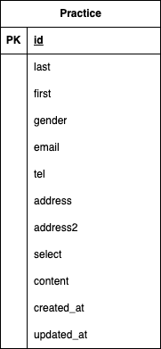

# test practice

## 環境構築

Dockerビルド
1. ディレクトリ作成
2. 各コンテナの設定ファイル記述
3. docker-compose up -d --build

Laravel環境構築
1. docker-compose exec php bash
2. composer create-project "laravel/laravel=8.*" . --prefer-dist
3. .envファイルの変更

、、、
DB_HOSTをmysqlに変更
DB_DATABASEをlaravel_dbに変更
DB_USERNAMEをlaravel_userに変更
DB_PASSをlaravel_passに変更
、、、

5. php artisan key:generate
6. php artisan migrate

## 使用技術

・PHP 8.1.34
・Laravel 8.83.29
・MySQL 8.0.36
・nginx 1.21.1

## ER 図

## URL

・開発環境：http://localhost/
・phpMyAdmin：http://localhost:8080/